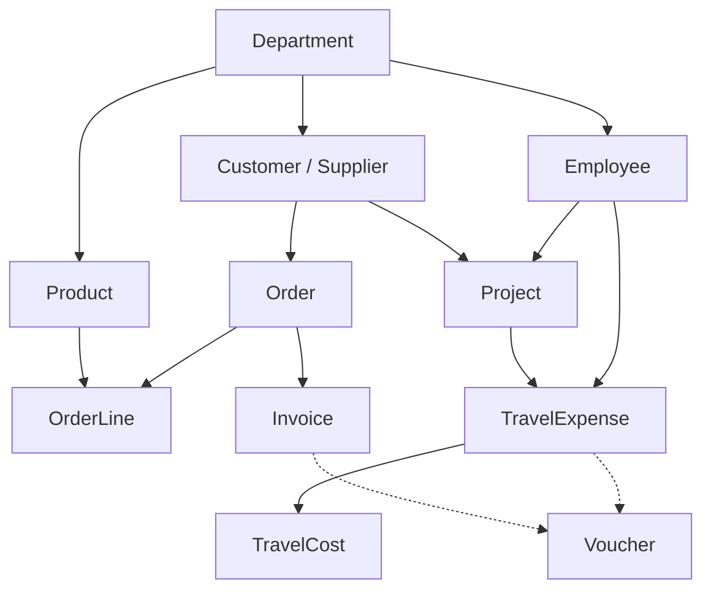

# Tripletex API v2 — Task handler reference (NM i AI 2026)

**Purpose:** What you need to design **task handlers** (create/update flows, dependencies, batching, and validation) against Tripletex REST API v2.

**Sources:** OpenAPI 3.0.1 (`openapi.json`, spec version **2.74.00**, **546** paths), fetched with:

`curl -s -k "https://kkpqfuj-amager.tripletex.dev/v2/openapi.json"`

A local copy used for this analysis: `docs/reports/tripletex-openapi.json` (~3.6 MB).

**Sandbox base URL:** `https://kkpqfuj-amager.tripletex.dev/v2`

> **Credentials:** Never commit session tokens or employee tokens. Use environment variables in agents and CI.

---

## 1. Overview of API patterns

### 1.1 Authentication

- **Scheme:** HTTP **Basic** (`tokenAuthScheme` in OpenAPI).
- **Username:** Company context — `0` or blank = logged-in employee’s company; other values = accountant client companies (see `/company/>withLoginAccess` in spec description).
- **Password:** **session token** (from `/token/session/:create` using consumer + employee tokens in production; sandbox may provide a session token directly).

### 1.2 Content type

- Request bodies: `application/json; charset=utf-8` (as in the spec).
- Responses: JSON with wrappers (below).

### 1.3 Response envelopes

| Shape | JSON | Notes |
|--------|------|--------|
| Single entity | `{ "value": { ... } }` | Typical for GET-by-id and POST create. |
| List / search | `{ "fullResultSize", "from", "count", "versionDigest", "values": [ ... ] }` | `fullResultSize` is marked deprecated in spec but still present. |
| Errors | `{ "status", "code", "message", "validationMessages", "requestId", ... }` | Often **422** with `code` 18000 and Norwegian field messages. |

**Headers:** `x-tlx-request-id` (and `requestId` in error body) for support correlation. Rate limit: `X-Rate-Limit-Limit`, `X-Rate-Rate-Limit-Remaining`, `X-Rate-Limit-Reset`; **429** when exceeded.

### 1.4 Pagination & filtering (list GETs)

- **Paging:** `from` (offset), `count` (page size, default often **1000**).
- **Sorting:** `sorting` — comma-separated fields; `-field` = descending; supports `relation.field` (e.g. `project.name`).
- **Field projection:** `fields` — reduces payload; supports `*` and nested patterns like `project(name)` or `project(*)`. See spec “Fields” section.
- **Authorization:** Missing fields or empty objects may appear when the token lacks rights (“Missing fields” in spec).

### 1.5 Optimistic locking

- Most persisted resources have **`id`** + **`version`**.
- **PUT** updates often require **version** match; mismatch → **409** with revision/duplicate style codes (see spec error list).

### 1.6 Partial updates

- Spec states: **PUT** with optional fields (not PATCH) for partial-style updates.

### 1.7 “Actions” and command-style URLs

- Paths may contain **`:action`** segments (e.g. `PUT /invoice/{id}/:send`).
- Aggregates may use **`>`** in the path (e.g. `/>thisWeeksBillables`).

---

## 2. Entity dependency graph (what must exist before what)

High-level **creation order** for typical accounting flows:

**Narrative:**

1. **Department** — referenced by employees, customers, suppliers, products, orders, projects, travel expenses.
2. **Employee** — needs **department**; may need **email** if `userType` is `STANDARD` / `EXTENDED` (sandbox validated).
3. **Customer** (and **Supplier**) — often need **department** + **currency**; ledger/account may be defaulted by Tripletex.
4. **Product** — needs **VAT** + **unit** + **currency**; **ledger account** must be **consistent** with the VAT type (see pitfalls). Products are referenced by **order lines**.
5. **Project** — requires **project manager** employee who has **project manager rights** in the company; **start date**; usually **customer** + **department**.
6. **Order** — requires **customer**, **orderDate**, **deliveryDate**; **order lines** are often created via **`POST /order/orderline`** (not only embedded in `POST /order`).
7. **Invoice** — requires **non-empty `orders`**, **`invoiceDate`**, **`invoiceDueDate`**; company may need **bank account** registered before invoicing (sandbox validated).
8. **Travel expense** — **`POST /travelExpense`** with **employee** is enough to open a report; **costs** (`POST /travelExpense/cost`) add lines and require **amount**, **payment type**, etc.
9. **Voucher** — ledger postings under **`/ledger/voucher`**; ties to accounting period and voucher type.

---

## 3. Per-entity details

> **OpenAPI caveat:** Most DTOs do **not** declare JSON Schema `required` arrays. **Runtime validation** (422) is the source of truth. Below mixes **schema enums**, **field descriptions**, and **sandbox observations**.

### 3.1 Employee — `POST /employee`, `PUT /employee/{id}`, `POST /employee/list`

| Topic | Detail |
|--------|--------|
| **Batch** | `POST /employee/list` → body **`Employee[]`**. |
| **Key fields** | `firstName`, `lastName`, `department: { id }`, `userType`, `email`, `employments`, `address`, … |
| **userType enum** | `STANDARD`, `EXTENDED`, `NO_ACCESS` |
| **Sandbox tests** | `{}` → firstName/lastName required. `STANDARD` without email → **“Må angis for Tripletex-brukere.”** `NO_ACCESS` + `firstName`/`lastName`/`department` → **201**. `STANDARD` + `email` → **201**. |
| **Task handler tip** | Prefer **`NO_ACCESS`** for “pure accounting” employees without Tripletex login; use **`STANDARD` + email** when the user should be a Tripletex user. |

### 3.2 Customer — `POST /customer`, `PUT /customer/{id}`, `POST /customer/list` [BETA]

| Topic | Detail |
|--------|--------|
| **Batch** | `POST /customer/list` → **`Customer[]`** (tagged **[BETA]** in spec). |
| **References** | `department`, `currency`, `ledgerAccount`, `accountManager` (employee), `category1`–`category3`, addresses. |
| **Sandbox** | Minimal `{ name, isCustomer: true, department: { id }, currency: { id: 1 } }` → **201** with generated `customerNumber`, ledger account, addresses. |

### 3.3 Supplier — `POST /supplier`, `POST /supplier/list`

| Topic | Detail |
|--------|--------|
| **Batch** | `POST /supplier/list` → **`Supplier[]`**. |
| **Pattern** | Similar to customer; flags `isSupplier` / `isCustomer`. |

### 3.4 Department — `POST /department`, `POST /department/list`

| Topic | Detail |
|--------|--------|
| **Batch** | `POST /department/list` → **`Department[]`**. |
| **Fields** | `name`, `departmentNumber`, `departmentManager`, `isInactive`, `businessActivityTypeId`, … |

### 3.5 Product — `POST /product`, `POST /product/list`

| Topic | Detail |
|--------|--------|
| **Batch** | `POST /product/list` → **`Product[]`**. |
| **Key fields** | `name`, `vatType`, `currency`, `department`, `productUnit`, `account`, prices (`priceExcludingVatCurrency`, …), `isStockItem`, … |
| **Enums** | `weightUnit`: `kg`, `g`, `hg`; `volumeUnit`: `cm3`, `dm3`, `m3`. |
| **Sandbox** | VAT type **3** (outgoing high) with sales account **3000** still returned **“Ugyldig mva-kode”** — **VAT/account must be valid for the company’s product rules**. VAT type **6** + **price** + **unit** + **department** succeeded. **Treat VAT type as company-configured, not “pick any id from `/ledger/vatType`”.** |

### 3.6 Order — `POST /order`, `PUT /order/{id}`, `POST /order/list`

| Topic | Detail |
|--------|--------|
| **Batch** | `POST /order/list` → **`Order[]`**. |
| **Order lines** | `POST /order/orderline`, `PUT /order/orderline/{id}`, `POST /order/orderline/list` → **`OrderLine[]`**. |
| **Required (sandbox)** | **`customer`**, **`orderDate`**, **`deliveryDate`**. |
| **status enum** | `NOT_CHOSEN`, `NEW`, `CONFIRMATION_SENT`, `READY_FOR_PICKING`, `PICKED`, `PACKED`, `READY_FOR_SHIPPING`, `READY_FOR_INVOICING`, `INVOICED`, `CANCELLED`. |
| **Other** | `invoicesDueInType`: `DAYS`, `MONTHS`, `RECURRING_DAY_OF_MONTH`; subscription fields when `isSubscription`. |
| **Task handler tip** | After `POST /order`, add lines with **`POST /order/orderline`** (embedded `orderLines` in create may not populate lines — verify per integration). |

### 3.7 Order line — `OrderLine`

| Topic | Detail |
|--------|--------|
| **References** | `product`, `order`, `vatType`, `currency`, optional `inventory` / `inventoryLocation`. |
| **Key fields** | `count`, `unitPriceExcludingVatCurrency` / `unitPriceIncludingVatCurrency`, `markup`, `discount`. |

### 3.8 Invoice — `POST /invoice`, `POST /invoice/list`

| Topic | Detail |
|--------|--------|
| **Batch** | `POST /invoice/list` → **`Invoice[]`**. |
| **Required (sandbox / validation)** | **`orders`**: non-null, **non-empty**; **`invoiceDate`**; **`invoiceDueDate`**. Spec: *“Only one order per invoice is supported at the moment.”* |
| **Read-only in schema** | Many amount fields, `orderLines`, `travelReports`, `deliveryDate`, `invoiceComment` (from order), etc. |
| **ehfSendStatus enum** | `DO_NOT_SEND`, `SEND`, `SENT`, `SEND_FAILURE_RECIPIENT_NOT_FOUND`. |
| **Commands** | e.g. `PUT /invoice/{id}/:send`, `/:payment`, `/:createReminder`, `/:createCreditNote`. |
| **Sandbox** | Valid payload blocked by: **“Faktura kan ikke opprettes før selskapet har registrert et bankkontonummer.”** — configure company bank account in Tripletex before invoicing. |

### 3.9 Travel expense — `POST /travelExpense`, `PUT /travelExpense/{id}`

| Topic | Detail |
|--------|--------|
| **Batch** | **No** `POST /travelExpense/list` in spec — create one report at a time. Sub-resources have `…/list` batch endpoints (e.g. participants). |
| **Create (sandbox)** | **`employee: { id }`** alone → **201**; department defaulted; `date` set; `state` **OPEN**. |
| **state enum** | `ALL`, `REJECTED`, `OPEN`, `APPROVED`, `SALARY_PAID`, `DELIVERED`. |
| **References** | `department`, `project`, `vatType`, `paymentCurrency`, `invoice`, `voucher`, … |

### 3.10 Travel cost line — `POST /travelExpense/cost`

| Topic | Detail |
|--------|--------|
| **Required (sandbox)** | **`amountCurrencyIncVat`**, **`paymentType`** (not null). |
| **Typical payload** | `travelExpense`, `paymentType`, `costCategory`, `currency`, amount fields. |
| **Sandbox** | Minimal cost with `travelExpense`, `paymentType`, `amountCurrencyIncVat`, `costCategory`, `currency` → **201**. |

### 3.11 Project — `POST /project`, `POST /project/list`

| Topic | Detail |
|--------|--------|
| **Batch** | `POST /project/list` → **`Project[]`**. |
| **Required (sandbox)** | **`projectManager`** must be an employee **with project manager access**; **`startDate`**; (customer/department as per business rules). |
| **displayNameFormat enum** | `NAME_STANDARD`, `NAME_INCL_CUSTOMER_NAME`, `NAME_INCL_PARENT_NAME`, `NAME_INCL_PARENT_NUMBER`, `NAME_INCL_PARENT_NAME_AND_NUMBER`. |
| **accessType enum** | `NONE`, `READ`, `WRITE`. |

### 3.12 Voucher (ledger) — `POST /ledger/voucher`, `PUT /ledger/voucher/{id}`

| Topic | Detail |
|--------|--------|
| **Path** | Under **`/ledger/voucher`**, not `/voucher` alone. |
| **Posting** | `Posting` links `account`, optional `customer`, `supplier`, `employee`, `project`, `product`, `department`, `vatType`, `currency`, … |

---

## 4. Batch / list POST endpoints (efficiency)

These **`POST …/list`** endpoints accept **arrays** and are the primary way to **reduce round-trips** when creating many rows:

| Resource | Endpoint | Body |
|----------|----------|------|
| Employee | `/employee/list` | `Employee[]` |
| Customer | `/customer/list` | `Customer[]` |
| Supplier | `/supplier/list` | `Supplier[]` |
| Department | `/department/list` | `Department[]` |
| Product | `/product/list` | `Product[]` |
| Order | `/order/list` | `Order[]` |
| Order line | `/order/orderline/list` | `OrderLine[]` |
| Invoice | `/invoice/list` | `Invoice[]` |
| Project | `/project/list` | `Project[]` |

**Not batchable:** main **`TravelExpense`** create (no `/travelExpense/list`); use single `POST /travelExpense` + line endpoints as needed.

---

## 5. Efficiency tips (minimize API calls)

1. **Use `fields`** on GETs to avoid huge nested graphs (e.g. `project(name),customer(name)`).
2. **Prefer bulk `POST` `/list`** when inserting many employees, customers, products, orders, invoices, or projects.
3. **Cache stable IDs** in the agent: `department`, `currency`, `ledger/vatType` (with caution — product VAT must match company rules), `product/unit`, `travelExpense/paymentType`, `travelExpense/costCategory`, `ledger/account`.
4. **Single order per invoice** — plan order/invoicing so you don’t split one invoice across multiple orders unnecessarily.
5. **Order lines:** confirm whether your flow embeds lines on `POST /order` or always uses **`POST /order/orderline`**; the latter is explicit and easy to batch with `/order/orderline/list`.
6. **If-None-Match / `versionDigest`** — for polling lists, consider conditional requests if your client supports them (see list response `versionDigest` description in responses).

---

## 6. Common pitfalls and validation requirements

| Pitfall | Mitigation |
|--------|------------|
| **No `required` in OpenAPI** | Always handle **422**; surface `validationMessages` to the agent. |
| **Product VAT vs account** | Choose **VAT types allowed for products** in the company; pair with a **ledger account** whose `legalVatTypes` includes that VAT (see `GET /ledger/account/{id}`). |
| **Employee user type vs email** | `STANDARD`/`EXTENDED` typically need **email**; `NO_ACCESS` avoids Tripletex user email requirement. |
| **Project manager** | Employee must have **project manager** entitlements — not every employee. |
| **Invoice prerequisites** | **Orders + dates**; plus **company bank account** (and other company settings) in real environments. |
| **Invoice vs order lines** | `orderLines` on `Invoice` are **read-only** in the schema — lines come from **orders** / process, not ad-hoc on invoice create. |
| **Auth scope** | Missing fields may be **authorization**; don’t assume null = absent. |
| **Rate limits** | Back off on **429**; watch `X-Rate-Limit-*` headers. |
| **Revision conflicts** | Send **`version`** on PUT when updating after GET. |

---

## 7. Quick reference — enums frequently used in handlers

| Area | Enum / values |
|------|----------------|
| Employee `userType` | `STANDARD`, `EXTENDED`, `NO_ACCESS` |
| Order `status` | `NOT_CHOSEN`, `NEW`, …, `INVOICED`, `CANCELLED` |
| Travel expense `state` | `ALL`, `REJECTED`, `OPEN`, `APPROVED`, `SALARY_PAID`, `DELIVERED` |
| Invoice `ehfSendStatus` | `DO_NOT_SEND`, `SEND`, `SENT`, `SEND_FAILURE_RECIPIENT_NOT_FOUND` |
| Change `changeType` (audit) | `CREATE`, `UPDATE`, `DELETE`, `LOCKED`, `REOPENED`, `DO_NOT_SHOW` |

---

## 8. Further reading (official)

- [Tripletex API 2.0 on GitHub](https://github.com/Tripletex/tripletex-api2) — changelog, examples.
- [developer.tripletex.no](https://developer.tripletex.no/) — authentication, tokens, practical guides.

---

*Generated for the Maskinkraft accounting agent project. Re-fetch `openapi.json` periodically — Tripletex evolves the spec (see `info.version`).*
